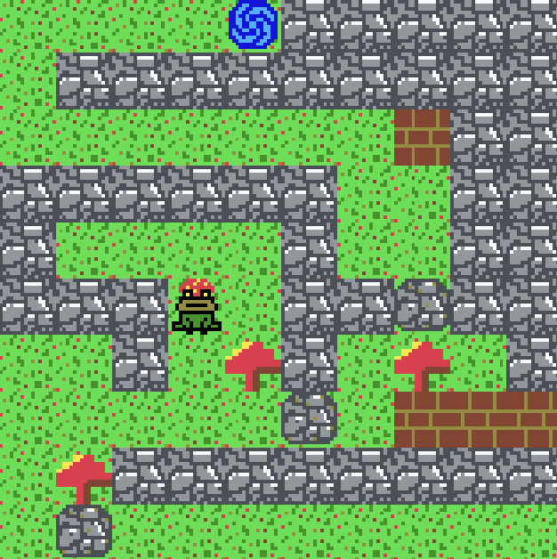

# 🐸 Fungi Frog Maze + Sprig Web Template 👾

This repository includes the open-source code for my game Fungi Frog Maze programmed using [Sprig](https://github.com/hackclub/sprig/), an open source game console, web-based game editor, and hardware development kit. This also works as a template for you to implement your own games.

- [fungi-frog-maze (sprig gallery)](https://sprig.hackclub.com/gallery/fungi-frog-maze)
- [fungi-frog-maze (itch.io)](https://jzaleta.itch.io/fungi-frog-maze)

Your mission is to guide the fungi-frog safely through each level (you can finish the game in 5 minutes or less) :

- Click on the game screen to get started, then use WASD to move around and j to restart the level. 
- You can push the fungi to move the rocks.
- You can go through the wooden walls.
- You can't go through the water.
- There are levels where there are no annoying rocks, yay!


----------------------------------------------------------------------
           
           (')-=-(')
         __(   "   )__
        / _/'-----'\_ \
     ___\\ \\     // //___
     >____)/_\---/_\(____<     


## Template Quickstart 

The index.html file has everything you need to get started, just add your js sprig game in the following segment replacing my game:
> If you get lost, check how I implemented my game inside the [index.html](https://github.com/jzaleta/sprig-web-template/blob/main/fungi-frog-maze/index.html) file!

```html
<!-- The Sprig device's aspect ratio is 5:4  -->
<canvas width="500" height="400" id="canvas" tabindex="0"></canvas>

<script type="module">
  import { webEngine } from "https://esm.sh/sprig@1/web"

  function runGame(api) {
    // Your game code here.
  }

  const game = webEngine(document.getElementById("canvas"))
  runGame(game.api)
</script>
```
Remember, to make a Sprig game you'll need to use [Sprig's Web Editor](https://sprig.hackclub.com/~/new).
